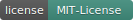

<div align="center">

[](https://wash-pro.tech)

[](https://github.com/WASH-PRO/WASH-PRO-PANEL)
[](https://github.com/WASH-PRO/WASH-PRO-PANEL)

<br>

[](https://wash-pro.tech)
[](https://github.com/WASH-PRO)
[](https://github.com/WASH-PRO)

### Контроллеры и электроника для автомоек самообслуживания

</div>

---

## 👋 О компании

**WASH-PRO** разрабатывает и производит **контроллеры, прошивки и периферию** для автомоек самообслуживания.

Мы закрываем полный цикл — от схемы и печатной платы до прошивки, веб-настройки, телеметрии и инструментов обслуживания на объекте.

| | |
| :--- | :--- |
| 🛠 **Для монтажника** | Понятная настройка через веб-интерфейс |
| 🏭 **Для владельца** | Стабильная работа 24/7, учёт оплат и режимов |
| ⚙️ **Для интегратора** | Модульная экосистема устройств под одну мойку |

---

## 🧩 Экосистема

<table>
  <tr>
    <th>Компонент</th>
    <th>Репозиторий</th>
    <th>Назначение</th>
  </tr>
  <tr>
    <td><strong>Панель управления</strong></td>
    <td><a href="https://github.com/WASH-PRO/WASH-PRO-PANEL">WASH-PRO-PANEL</a></td>
    <td>Контроллер мойки: режимы, оплата, дисплей, Wi‑Fi, веб-интерфейс</td>
  </tr>
  <tr>
    <td><strong>NFC‑ридер</strong></td>
    <td><a href="https://github.com/WASH-PRO/WASH-PRO-NFC">WASH-PRO-NFC</a></td>
    <td>Считывание клиентских, сервисных и служебных карт</td>
  </tr>
  <tr>
    <td><strong>Pulse‑конвертер</strong></td>
    <td><a href="https://github.com/WASH-PRO/WASH-PRO-PULSE">WASH-PRO-PULSE</a></td>
    <td>Импульсы терминала эквайринга → контроллер оборудования</td>
  </tr>
  <tr>
    <td><strong>Контроль воды</strong></td>
    <td><a href="https://github.com/WASH-PRO/WATER-LEVEL-CONTROLLER">WATER-LEVEL-CONTROLLER</a></td>
    <td>Fail-safe контроль уровня, веб‑панель, OTA</td>
  </tr>
  <tr>
    <td><strong>Дашборд</strong></td>
    <td><a href="https://github.com/WASH-PRO/WASH-PRO-DASHBOARD">WASH-PRO-DASHBOARD</a></td>
    <td>Серверный сбор данных с контроллеров</td>
  </tr>
  <tr>
    <td><strong>PCB / производство</strong></td>
    <td><a href="https://github.com/WASH-PRO/WASH-PRO-EASYEDA">WASH-PRO-EASYEDA</a></td>
    <td>Файлы и разработка печатных плат</td>
  </tr>
  <tr>
    <td><strong>Карты доступа</strong></td>
    <td><a href="https://github.com/WASH-PRO/WASH-PRO-CARDS">WASH-PRO-CARDS</a></td>
    <td>Карты для моек серии Geldbaum</td>
  </tr>
  <tr>
    <td><strong>Агент</strong></td>
    <td><a href="https://github.com/WASH-PRO/wash-pro-agent">wash-pro-agent</a></td>
    <td>Удалённое обслуживание и интеграции</td>
  </tr>
</table>

---

## ⭐ WASH-PRO-PANEL

Флагманский репозиторий прошивки контроллера — [ветка `main`](https://github.com/WASH-PRO/WASH-PRO-PANEL/tree/main):

```
• RGB-матрицы 320×160 и 256×128
• Наличные, безнал, NFC-карты, сервисные и VIP-режимы
• Веб-настройка (GyverPortal), 16 языков
• Отдельные ветки под экраны, языки и ревизии железа
```

<div align="center">

[](https://github.com/WASH-PRO/WASH-PRO-PANEL)

</div>

---

## 🛠 Стек

<div align="center">


</div>

---

<div align="center">

**[wash-pro.tech](https://wash-pro.tech)** · **[github.com/WASH-PRO](https://github.com/WASH-PRO)**

<br>

<sub>Баннер и бейджи в шапке — из репозитория <a href="https://github.com/WASH-PRO/WASH-PRO-PANEL/tree/main/images">WASH-PRO-PANEL</a>, ветка <code>main</code></sub>

<br>

<sub>© WASH-PRO · Контроллеры для автомоек самообслуживания</sub>

</div>
